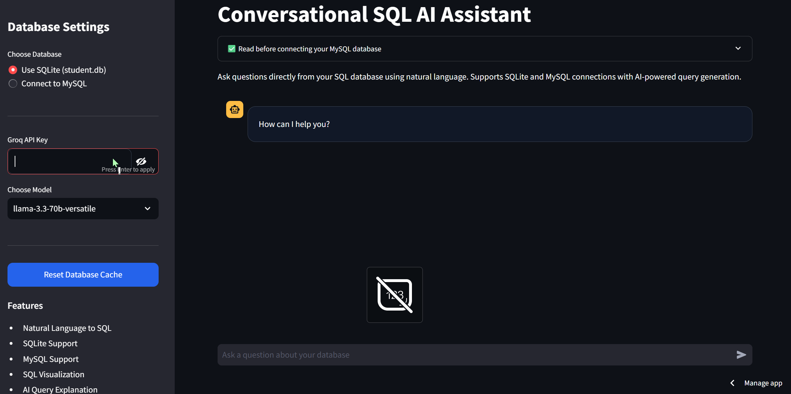
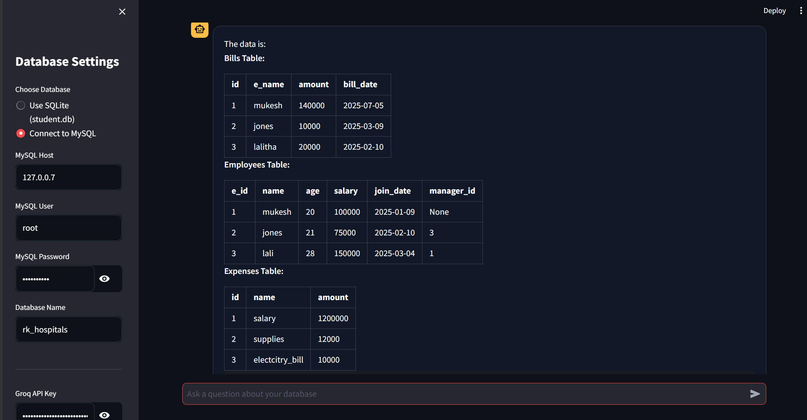

**Conversational SQL AI Assistant**

An AI-powered SQL chatbot built with Streamlit, LangChain, and Groq LLMs that allows users to interact with SQL databases using natural language.

This project converts plain English questions into SQL queries and retrieves results directly from SQLite or MySQL databases.

## Conversational SQL AI Assistant enables users to:

-Query databases without writing SQL manually

-Connect to SQLite and MySQL databases

-Generate SQL queries automatically using AI

-Visualize query results

-Explain generated SQL queries

-Interact through a modern chat-based UI

The application uses LangChain SQL Agents with Groq LLMs for fast SQL reasoning and execution.

## Features
AI-Powered SQL Querying

-The AI automatically converts these prompts into SQL queries.

-Multiple Database Support

-SQLite Support

-Uses a local SQLite database (student.db) for testing and demonstrations.

-MySQL Support

## Only safe read operations are allowed.

-Users can connect their own MySQL databases by providing:

Host
 
Username  
                      
Password  

Database Name

Query Visualization

SQL Query Explanation

Users can click the "Explain This Query" button to understand how the generated SQL works.

Secure SQL Execution

Dangerous SQL operations are blocked automatically.

Restricted operations:

-DELETE

-DROP

-UPDATE

-INSERT

-ALTER

-TRUNCATE

[Live Demo](https://conversational-sql-ai-58dwjgztcdybypqz7wyuhm.streamlit.app/)
